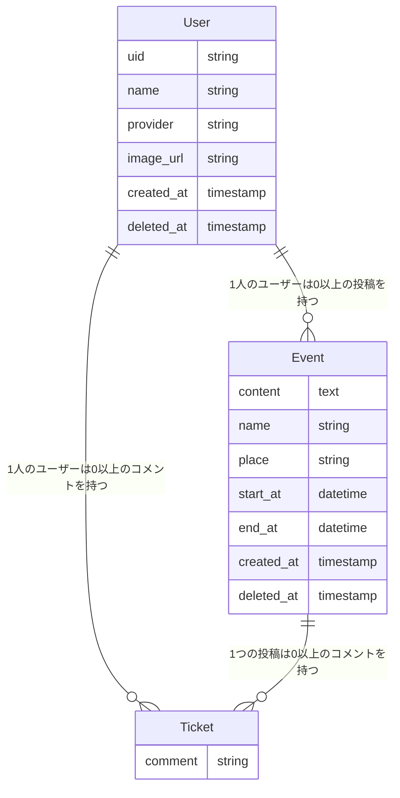

# awesome events
パーフェクトRuby on Rails第2版の第6章で作成されたサンプルアプリ
イベント情報を登録／編集したり、イベントに参加登録したりできます。

## 環境
* Ruby 2.7.6
* Rails 6.0.6
* Node.js
* Yarn
* libvips
* Elasticsearch
  * Japanese (kuromoji) Analysis Plugin

## セットアップ方法

```sh
https://github.com/perfect-ruby-on-rails/awesome_events.git
cd awesome_events
bundle install
yarn install
bin/rails db:setup
```

第6章 OAuthを利用して「GitHubでログイン」機能を作る を参考に、GitHubアプリケーションを登録します。手に入れたClient IDとClient Secretを`config/initializers/omniauth.rb`に設定します。

次のコマンドでElasticsearchを起動します

```sh
elasticsearch
```

次のコマンドでサーバが立ち上がり、 http://localhost:3000 でアクセスできます。

```sh
./bin/rails s
```

## テストの実行方法

### システムテストの実行方法

elasticsearchを起動した状態で次のコマンドを実行します。

```sh
bin/rails test:system
```

### システムテスト以外のテストの実行方法

次のコマンドを実行します。

```sh
bin/rails test
```

## ルーティング
|  パス  |  メソッド  |  内容  |
| ---- | ---- | ---- |
|  /  |  GET  |  イベント一覧  |
|  /auth/:provider/callback  |  GET  |  ログイン/ユーザー作成処理  |
|  /logout  |  DELETE  |  ログアウトを実行  |
|  /events/new  |  GET  |  イベント作成用フォームを表示  |
|  /events  |  POST  |  イベント作成処理を実行  |
|  /events/:id  |  GET  |  イベント詳細ページの表示  |
|  /events/:id/edit  |  GET  |  イベント編集用フォームを表示  |
|  /events/:id  |  PATCH  |  イベント編集処理を実行  |
|  /events/:id  |  DELETE  |  イベント削除処理を実行  |
|  /events/:event_id/tickets  |  POST  |  イベント参加処理を実行  |
|  /events/:event_id/tickets/:id  |  DELETE  |  イベント参加キャンセルを実行  |
|  /retirements/new  |  GET  |  退会用画面の表示  |
|  /retirements  |  POST  |  退会処理を実行  |


## ER図

